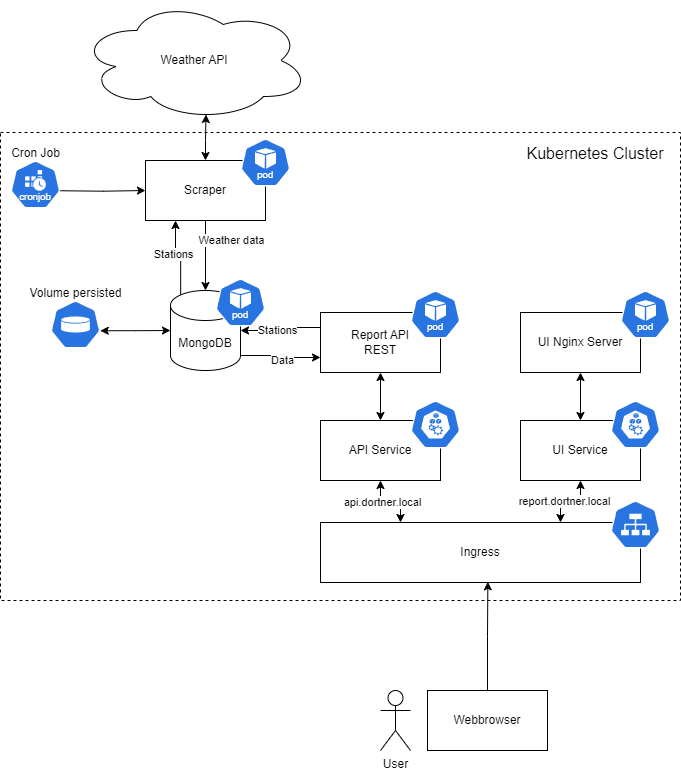

# Weather Report
## Run in minikube
Prepeare Environment in windows:

```
docker context use default
minikube start
kubectl config set-context --current --namespace=weather-report
```

Apply all files from `./kubernetes`

Add the following entries to your hosts file (`C:\Windows\System32\drivers\etc\hosts` or `/etc/hosts`):

```
127.0.0.1 report.dortner.local
127.0.0.1 api.dortner.local
```

UI is available at `http://report.dortner.local`

## Architecture


Python is used in all backend code as it is quite easy to use. Furthermore, a Metar and TAF library is available.

Kubernetes is used as I never really worked with it and I wanted to test it.

### Scraper
Fetches the stations from the database and requests the Metar and TAF data from the Weather API. The responses are parsed using the `metar-taf-parser-mivek` Python library. Once the raw Metar and TAF string is parsed, an easier to access data structure is created. This structure is then saved to the database.

### MongoDB
Stores three collections:
- `station`: All stations which are supported. Consists of a code and a more readable name
- `metar_conditions`: Parsed metar conditions with station code and issue time as unique value pair.
- `taf_conditions`: Parsed taf conditions with trends. Code and issue time is a unique value pair.

MongoDB was used as it is easily integrated with Python and not all objects have to look the same. Especially the TAF data not always contains the same data, therefore a equal relational database would contain many null values.

### Report API
Pyhton FastAPI webserver which provides a REST API. It is used to access and modify the stations. Also the parsed Metar and TAF data is further refined into a readable sentence before it gets returned.  

### UI
The UI is a simple nginx server with a HTML, CSS and JavaScrip combo. It accesses the Report API and provides a more or less user friendly interface.

## Building
Execute the build powershell scripts in the src folder to build and push the containers.

The following images are to be built:
- `dortner/clc6-weather-report-ui`: Ngnix webserver used to serve the UI
- `dortner/clc6-weather-report-scraper`: Python with scraper code
- `dortner/clc6-weather-report-api`: Python with REST API code

## Legacy
Start API: `minikube service weather-api-service -n weather-report`
Open UI: `minikube service weather-report-service -n weather-report`

## Fehler
### Image not found when starting deployment

- In the deployment `imagePullPolicy: IfNotPresent` or `Always`
- Building the docker image in the minikube `& minikube -p minikube docker-env --shell powershell | Invoke-Expression`
- Last resort: `minikube image load weather-report-ui:latest`

### Ingress not working
- Run `minikube tunnel` to make the ingress available to localhost
- Ensure the `hosts` file contains the domains pointing to `127.0.0.1`
